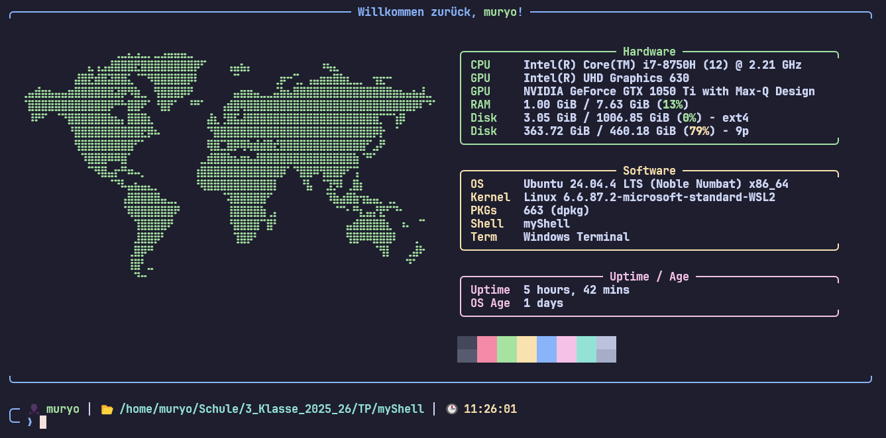
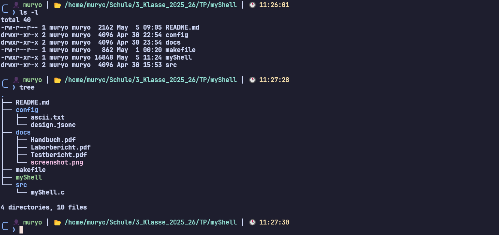

# </> myShell

Dieses Projekt wurde im Rahmen des Fachs TP an der TFO "Max Valier" Bozen (Schuljahr 2025/26) entwickelt. Ziel war es, eine eigene Linux-Shell in C zu programmieren, die Befehle einliest, parst und in Kindprozessen ausführt.



## ✨ Funktionen

- **Befehlsausführung:** Führt Standard-Linux-Befehle (z.B. `ls`, `grep`, `echo`) inklusive Argumenten aus.
- **Pfad-Unterstützung:** Erkennt sowohl Programmnamen im System-Pfad als auch direkte Pfadangaben (absolut/relativ).
- **Benutzerkomfort:** Integration der GNU `readline`-Bibliothek für History-Funktion und Navigation mit den Pfeiltasten.
- **Startbildschirm:** Automatischer Aufruf von `fastfetch` mit einem eigenen ASCII-Logo und Systeminfos beim Start.
- **Built-in Befehle:** Native Unterstützung für `cd` (Verzeichniswechsel) und `exit`.
- **Globales Setup:** Vollständige Installation und Deinstallation über das Makefile.



## 🛠️ Installation & Vorbereitung

Damit die Shell korrekt funktioniert (insbesondere das Design und das ASCII-Logo), muss sie systemweit installiert werden. Dadurch werden die Konfigurationsdateien an den erwarteten Pfad `/etc/myShell/config/` kopiert.

### 1. Repository klonen

Zuerst das Projekt von GitHub auf den lokalen Rechner kopieren:

```bash
git clone https://github.com/muryo-void/myShell.git
cd myShell
```

### 2. Abhängigkeiten installieren

Stellen Sie sicher, dass `libreadline` und `fastfetch` installiert sind:

```bash
make install-deps
```

### 3. Kompilieren und systemweite Installation

Dies ist der wichtigste Schritt. Das Programm wird kompiliert und die Assets (Logo & Design) werden in das Systemverzeichnis kopiert:

```bash
make
sudo make install
```

## 🚀 Benutzung

Nach der erfolgreichen Installation kann die Shell von jedem beliebigen Verzeichnis aus gestartet werden:

```bash
myShell
```

## 🗑️ Deinstallation

Um das Programm und alle erstellten Konfigurationsordner (`/etc/myShell`) restlos zu entfernen:

```bash
sudo make uninstall
```

## 👨‍💻 Autor

Adrian Pinggera  
Klasse: 3ib - 2025_26

Technologische Fachoberschule "Max Valier" Bozen
