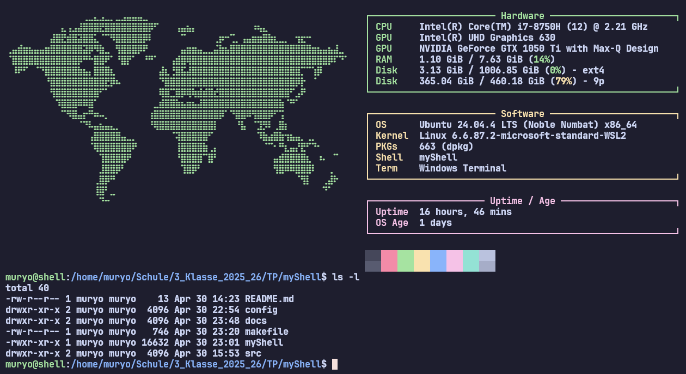

# myShell

Dieses Projekt wurde im Rahmen des Fachs TP an der TFO "Max Valier" Bozen (Schuljahr 2025/26) entwickelt. Ziel war es, eine eigene Linux-Shell in C zu programmieren, die Befehle einliest, parst und in Kindprozessen ausführt.



## ✨ Funktionen

- **Befehlsausführung:** Führt Standard-Linux-Befehle (z.B. `ls`, `grep`, `echo`) inklusive Argumenten aus.
- **Pfad-Unterstützung:** Erkennt sowohl Programmnamen im System-Pfad als auch direkte Pfadangaben (absolut/relativ).
- **Benutzerkomfort:** Integration der GNU `readline`-Bibliothek für History-Funktion und Navigation mit den Pfeiltasten.
- **Startbildschirm:** Automatischer Aufruf von `fastfetch` mit einem eigenen ASCII-Logo und Systeminfos beim Start.
- **Built-in Befehle:** Native Unterstützung für `cd` (Verzeichniswechsel) und `exit`.
- **Globales Setup:** Vollständige Installation und Deinstallation über das Makefile.

## 🛠️ Installation & Vorbereitung

### 1. Repository klonen

Zuerst das Projekt von GitHub auf den lokalen Rechner kopieren:

```bash
git clone [https://github.com/DEIN_USERNAME/myShell.git](https://github.com/DEIN_USERNAME/myShell.git)
cd myShell
```
